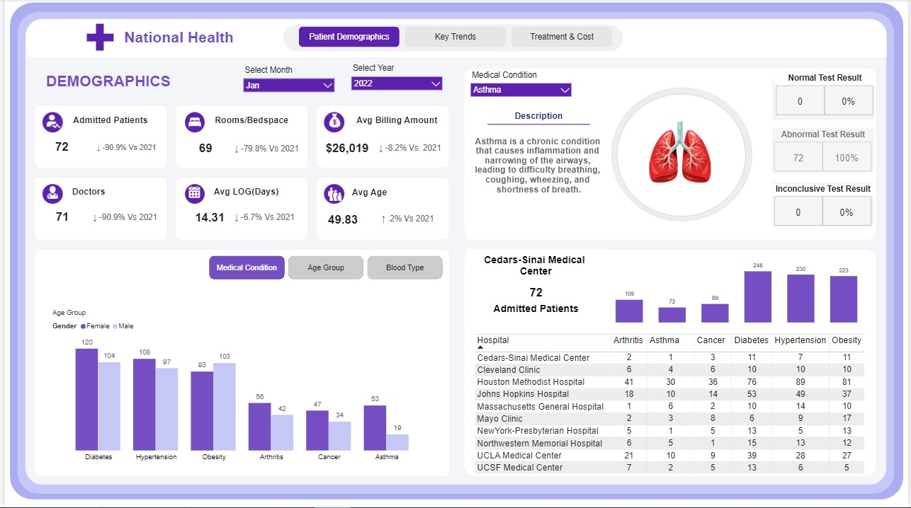

# 🏥 National Health Analytics Dashboard | Power BI

An interactive **National Health Analytics Dashboard** built with **Microsoft Power BI** to analyze patient demographics, hospital trends, medical conditions, treatment patterns, length of stay, medication usage, insurance providers, and healthcare billing.

The dashboard is designed as a 3-page business intelligence report:

1. **Patient Demographics**
2. **Key Trends**
3. **Treatment & Cost**

---

## 📊 Dashboard Preview

### 1. Patient Demographics



This page provides an overview of patient demographics and medical conditions, including:

- Admitted Patients
- Rooms / Bedspace
- Average Billing Amount
- Doctors
- Average Length of Stay
- Average Age
- Medical condition distribution by gender and age group
- Hospital-level medical condition analysis
- Normal, abnormal, and inconclusive test results

---

### 2. Key Trends


This page focuses on admission patterns and operational trends:

- Admissions by day type
- Length of Stay (LOS) buckets
- Monthly admission trends
- Daily admission breakdown
- Emergency, Elective, and Urgent admission analysis
- Year-over-year KPI comparison
- Medical condition and hospital filters

---

### 3. Treatment & Cost


This page analyzes healthcare costs and treatment patterns:

- Total billing accumulated by length of stay
- Billing by insurance provider
- Top medications
- Medical condition vs medication analysis
- Average billing amount
- Average length of stay
- Hospital and insurance provider analysis

---

## 🎯 Business Objectives

The dashboard was developed to answer practical healthcare business questions such as:

- Which medical conditions contribute to the highest patient volume?
- How do patient admissions vary across months and days?
- Which hospitals handle the highest number of patients?
- What is the distribution of patient length of stay?
- How does billing vary by insurance provider?
- Which medications are most frequently used?
- How do emergency, elective, and urgent admissions compare?
- What are the key changes compared with the previous year?

---

## 🛠️ Tools & Technologies

| Tool | Purpose |
|---|---|
| **Microsoft Power BI** | Dashboard development and data visualization |
| **Power Query** | Data cleaning and transformation |
| **DAX** | Measures, KPIs, calculations and time intelligence |
| **Data Modeling** | Relationships and analytical model design |
| **Excel / CSV** | Data source and preparation |

---

## 📌 Key KPIs

The dashboard tracks important healthcare performance indicators including:

- Total Admitted Patients
- Total Doctors
- Rooms / Bedspace
- Average Billing Amount
- Average Length of Stay
- Average Patient Age
- Total Billing
- Admission Trends
- Medication Usage
- Insurance Provider Billing
- Medical Condition Distribution

---

## 📈 Main Visualizations

The report uses a combination of:

- KPI Cards
- Column Charts
- Line Charts
- Donut Charts
- Matrix Tables
- Slicers
- Conditional Formatting
- Drill/filter interactions

---

## 🧮 Data Analysis Areas

### Patient Demographics
Analysis of age, gender, medical condition and test results.

### Hospital Performance
Comparison of admissions and medical conditions across hospitals.

### Admission Trends
Monthly and daily analysis of patient admissions.

### Length of Stay
Patients are grouped into:

- Short Stay: 0–3 days
- Moderate Stay: 4–7 days
- Long Stay: 8–14 days
- Extended Stay: 15+ days

### Treatment & Medication
Analysis of medication usage across different medical conditions.

### Healthcare Cost
Analysis of billing by insurance provider and length of stay.

---

## 💡 Key Insights

The dashboard enables stakeholders to identify:

- High-volume medical conditions
- Admission peaks and seasonal patterns
- Differences between weekday and weekend admissions
- Long-stay patient patterns
- Major contributors to healthcare billing
- Medication demand across conditions
- Hospital-level differences in patient volume
- Insurance-provider billing patterns

---

## 📂 Project Structure

```text
National-Health-Analytics-PowerBI/
│
├── assets/
│   ├── 01-patient-demographics.png
│   ├── 02-key-trends.png
│   └── 03-treatment-and-cost.png
│
├── README.md
└── .gitignore
```

> Add your `.pbix` file to the repository if you want recruiters or viewers to download and inspect the Power BI report. For large files, consider using Git LFS or sharing the PBIX through an appropriate cloud-storage link.

---

## 🚀 How to Use

1. Clone or download this repository.
2. Open the Power BI `.pbix` file.
3. Use the slicers to filter by year, hospital, medical condition and other available dimensions.
4. Navigate between the three dashboard pages.
5. Interact with charts and tables to explore healthcare trends.

---

## 👨‍💻 Author

**Raiful Islam Ratul**

Data Analyst | Power BI | SQL | Excel | Python

📍 Chattogram, Bangladesh

---

## ⭐ Project Purpose

This project is part of my **Data Analytics portfolio**, demonstrating practical skills in:

- Business Intelligence
- Data Cleaning
- Data Modeling
- DAX
- Power BI Dashboard Design
- KPI Development
- Healthcare Analytics
- Business-oriented Data Storytelling

If you find this project useful, feel free to ⭐ the repository.
